# Kiến trúc Tích hợp MCP vào BaseStep

## 📐 Architecture Diagram

### 1. Tổng quan Kiến trúc

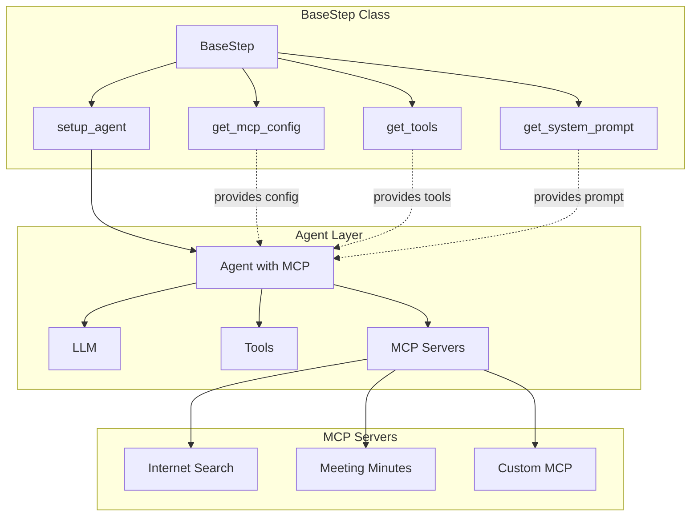

### 2. Luồng Khởi tạo Agent với MCP

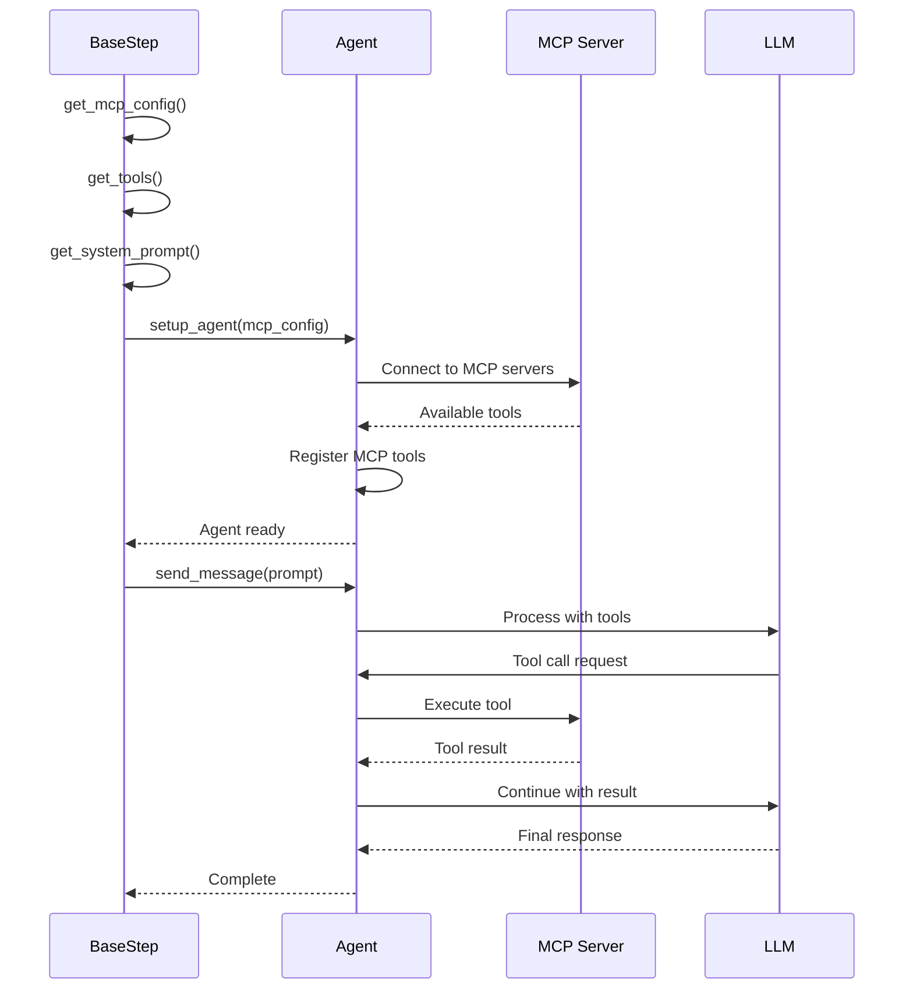

### 3. Class Hierarchy

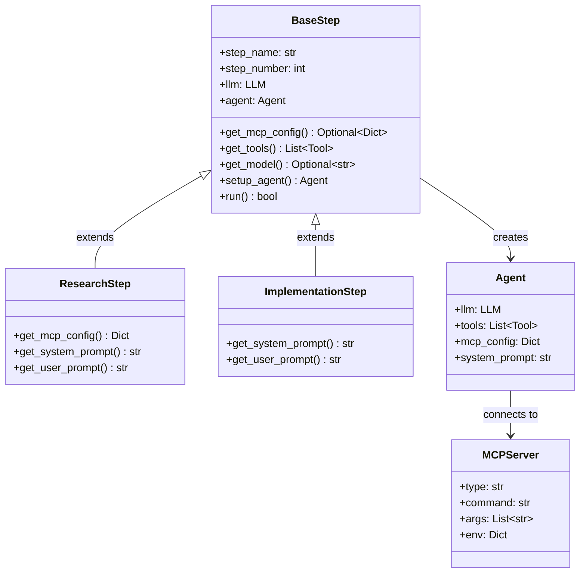

### 4. MCP Configuration Flow

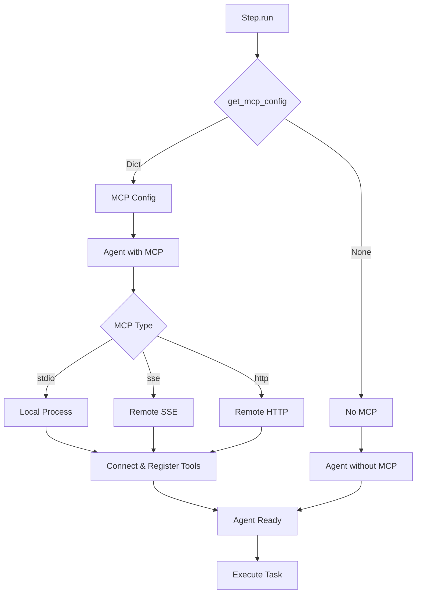

### 5. Tool Resolution

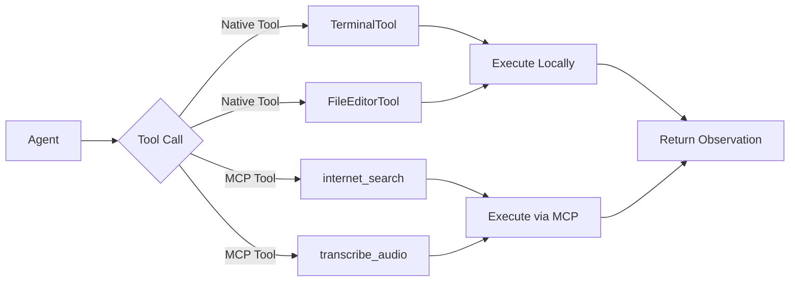

### 6. Error Handling Flow

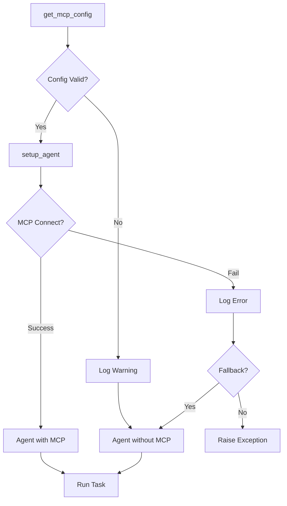

## 🔧 Component Details

### BaseStep với MCP Support

```python
class BaseStep(ABC):
    """Base class with MCP support."""
    
    def get_mcp_config(self) -> Optional[Dict[str, Any]]:
        """
        Override this method to provide MCP configuration.
        
        Returns:
            None: No MCP servers (default)
            Dict: MCP configuration with servers
        """
        return None
    
    def setup_agent(self) -> Agent:
        """Initialize Agent with optional MCP support."""
        if not self.llm:
            self.setup_llm()
        
        mcp_config = self.get_mcp_config()
        
        agent_kwargs = {
            "llm": self.llm,
            "tools": self.get_tools(),
            "system_prompt": self.get_system_prompt()
        }
        
        if mcp_config:
            agent_kwargs["mcp_config"] = mcp_config
        
        self.agent = Agent(**agent_kwargs)
        return self.agent
```

### MCP Configuration Structure

```python
{
    "servers": {
        "server-name": {
            # Required
            "type": "stdio" | "sse" | "http",
            
            # For stdio
            "command": "/path/to/executable",
            "args": ["arg1", "arg2"],
            "env": {
                "KEY": "value"
            },
            
            # For sse/http
            "url": "http://example.com/mcp",
            "headers": {
                "Authorization": "Bearer token"
            }
        }
    },
    
    # Optional global settings
    "convert_schemas_to_strict": True,
    "failure_error_function": None
}
```

## 🎯 Design Patterns

### 1. Template Method Pattern

BaseStep định nghĩa template cho việc khởi tạo agent:

```python
# Template method in BaseStep
def setup_agent(self) -> Agent:
    # Step 1: Setup LLM
    if not self.llm:
        self.setup_llm()
    
    # Step 2: Get configuration (hook method)
    mcp_config = self.get_mcp_config()  # Override point
    tools = self.get_tools()            # Override point
    prompt = self.get_system_prompt()   # Override point
    
    # Step 3: Create agent
    self.agent = Agent(
        llm=self.llm,
        tools=tools,
        system_prompt=prompt,
        mcp_config=mcp_config if mcp_config else None
    )
    
    return self.agent
```

### 2. Strategy Pattern

Mỗi step có thể chọn strategy khác nhau cho MCP:

```python
# Strategy 1: No MCP
class SimpleStep(BaseStep):
    # Don't override get_mcp_config()
    pass

# Strategy 2: Single MCP
class ResearchStep(BaseStep):
    def get_mcp_config(self):
        return {"servers": {"internet-search": {...}}}

# Strategy 3: Multiple MCP
class AdvancedStep(BaseStep):
    def get_mcp_config(self):
        return {
            "servers": {
                "internet-search": {...},
                "meeting-minutes": {...}
            }
        }
```

### 3. Factory Pattern

MCP servers được tạo dựa trên configuration:

```python
def create_mcp_server(config: Dict) -> MCPServer:
    """Factory method for creating MCP servers."""
    server_type = config.get("type")
    
    if server_type == "stdio":
        return MCPServerStdio(
            command=config["command"],
            args=config["args"],
            env=config.get("env", {})
        )
    elif server_type == "sse":
        return MCPServerSSE(
            url=config["url"],
            headers=config.get("headers", {})
        )
    elif server_type == "http":
        return MCPServerHTTP(
            url=config["url"]
        )
    else:
        raise ValueError(f"Unknown MCP type: {server_type}")
```

## 🔄 Lifecycle Management

### Agent Lifecycle với MCP

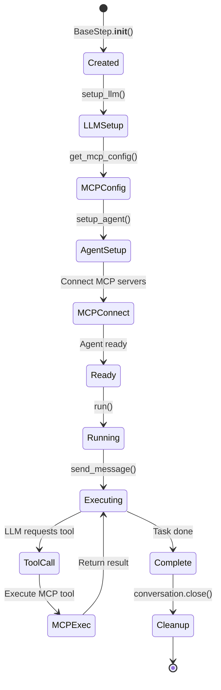

### MCP Server Lifecycle

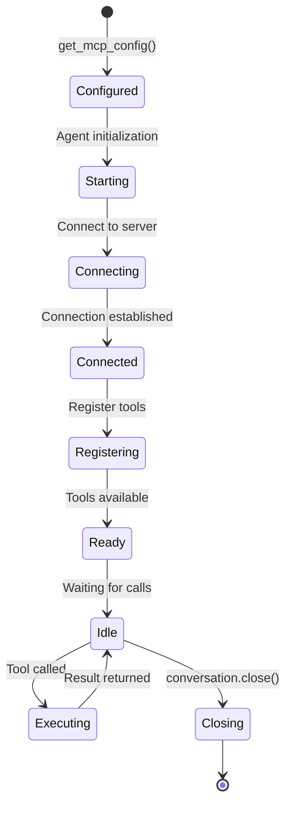

## 📊 Performance Considerations

### 1. MCP Server Startup Time

```mermaid
gantt
    title MCP Server Initialization Timeline
    dateFormat X
    axisFormat %s
    
    section Stdio MCP
    Process Start: 0, 100
    Import Modules: 100, 300
    Initialize Server: 300, 500
    Register Tools: 500, 600
    Ready: 600, 600
    
    section SSE MCP
    HTTP Connect: 0, 200
    Handshake: 200, 400
    Register Tools: 400, 500
    Ready: 500, 500
```

### 2. Tool Call Latency

- **Native Tools**: ~10-50ms (local execution)
- **Stdio MCP**: ~50-200ms (process communication)
- **SSE MCP**: ~100-500ms (network + processing)
- **HTTP MCP**: ~100-500ms (network + processing)

### 3. Optimization Strategies

1. **Lazy Loading**: Chỉ connect MCP khi cần
2. **Connection Pooling**: Reuse connections
3. **Caching**: Cache MCP tool results
4. **Parallel Execution**: Execute multiple MCP calls concurrently

## 🔒 Security Considerations

### 1. API Key Management

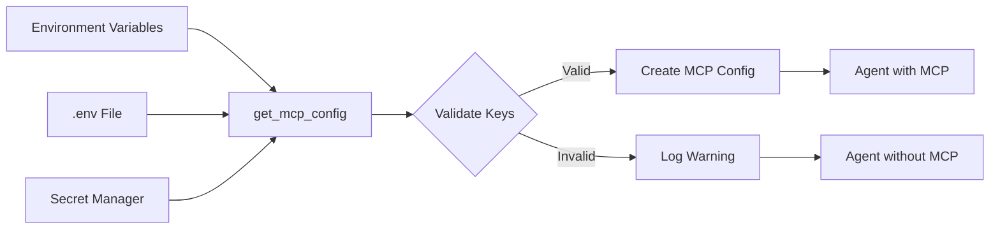

### 2. MCP Server Trust

- **Stdio**: Trusted local processes
- **SSE/HTTP**: Verify SSL certificates
- **Authentication**: Use API keys or OAuth

### 3. Tool Permissions

```python
# Example: Restrict MCP tools
def get_mcp_config(self):
    return {
        "servers": {
            "internet-search": {
                "type": "stdio",
                "command": "...",
                # Restrict to read-only operations
                "permissions": ["read"]
            }
        }
    }
```

## 🧪 Testing Strategy

### 1. Unit Tests

```python
def test_get_mcp_config_default():
    """Test default MCP config is None."""
    step = BaseStep("test", 1)
    assert step.get_mcp_config() is None

def test_get_mcp_config_override():
    """Test MCP config override."""
    class TestStep(BaseStep):
        def get_mcp_config(self):
            return {"servers": {"test": {}}}
    
    step = TestStep("test", 1)
    config = step.get_mcp_config()
    assert config is not None
    assert "servers" in config
```

### 2. Integration Tests

```python
def test_agent_with_mcp():
    """Test agent creation with MCP."""
    step = ResearchStep()
    agent = step.setup_agent()
    
    # Verify MCP tools are registered
    assert "internet_search" in agent.available_tools
```

### 3. End-to-End Tests

```python
def test_mcp_tool_execution():
    """Test MCP tool execution."""
    step = ResearchStep()
    success = step.run()
    
    assert success
    # Verify MCP tool was called
    assert "internet_search" in step.conversation.tool_calls
```

## 📈 Monitoring & Observability

### 1. Logging

```python
import logging

logger = logging.getLogger(__name__)

def setup_agent(self):
    mcp_config = self.get_mcp_config()
    
    if mcp_config:
        logger.info(f"Setting up agent with MCP servers: {list(mcp_config['servers'].keys())}")
    else:
        logger.info("Setting up agent without MCP")
    
    # ... rest of setup
```

### 2. Metrics

- MCP connection time
- Tool call latency
- Success/failure rates
- Error types and frequencies

### 3. Tracing

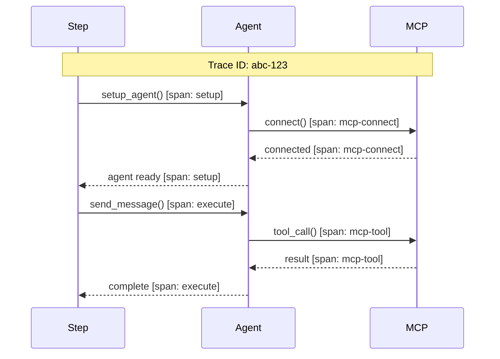

## 🎓 Best Practices Summary

1. **Configuration**
   - Use environment variables for sensitive data
   - Validate MCP config before use
   - Provide sensible defaults

2. **Error Handling**
   - Graceful degradation when MCP unavailable
   - Clear error messages
   - Fallback to non-MCP mode

3. **Performance**
   - Lazy load MCP servers
   - Cache tool results when appropriate
   - Monitor latency

4. **Security**
   - Never hardcode API keys
   - Validate MCP server certificates
   - Restrict tool permissions

5. **Testing**
   - Unit test configuration methods
   - Integration test MCP connections
   - E2E test tool execution

6. **Documentation**
   - Document required environment variables
   - Provide usage examples
   - Explain MCP server requirements
