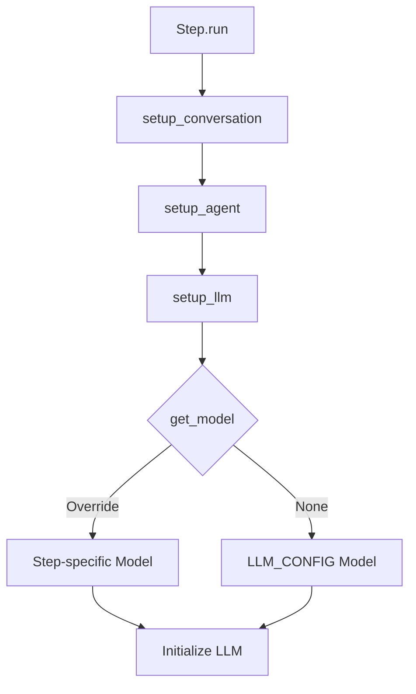

# Kế hoạch: Bổ sung tham số Model cho mỗi Step

## 📋 Tổng quan

Hiện tại, tất cả các steps trong pipeline đều sử dụng chung một model được định nghĩa trong [`LLM_CONFIG`](../openhands_operation/config.py:101). Yêu cầu là cho phép mỗi step có thể sử dụng model riêng, linh hoạt hơn trong việc chọn model phù hợp với từng tác vụ cụ thể.

## 🎯 Mục tiêu

- Cho phép mỗi step tự định nghĩa model riêng thông qua method `get_model()`
- Vẫn giữ backward compatibility với các step hiện tại (fallback về LLM_CONFIG)
- Hỗ trợ override model qua constructor (optional)
- Dễ dàng sử dụng và maintain

## 🏗️ Kiến trúc hiện tại

### File cần sửa đổi:

1. **[`base_step.py`](../openhands_operation/base_step.py)** - Base class cho tất cả steps
   - Dòng 72-80: Method `setup_llm()` - Khởi tạo LLM với config cố định
   - Dòng 21-36: Constructor `__init__()` - Khởi tạo step

2. **[`config.py`](../openhands_operation/config.py)** - Shared configuration
   - Dòng 101-106: `LLM_CONFIG` - Default LLM configuration

### Luồng hoạt động hiện tại:


## 🔧 Thiết kế giải pháp

### 1. Thêm method `get_model()` vào BaseStep

```python
def get_model(self) -> Optional[str]:
    """
    Return the model name for this step.
    Override this method in subclass to use a different model.
    
    Returns:
        str: Model name (e.g., "openai/gpt-4", "openai/sonnet-4")
        None: Use default model from LLM_CONFIG
    """
    return None  # Default: use LLM_CONFIG
```

**Lợi ích:**
- Mỗi step có thể override method này để chỉ định model riêng
- Return `None` để sử dụng default model (backward compatible)
- Rõ ràng, dễ hiểu, dễ maintain

### 2. Cập nhật `setup_llm()` để sử dụng `get_model()`

```python
def setup_llm(self) -> LLM:
    """Initialize and return LLM instance."""
    # Get model from step-specific config or fallback to default
    model = self.get_model() or LLM_CONFIG["model"]
    
    self.llm = LLM(
        model=model,
        api_key=LLM_CONFIG["api_key"],
        base_url=LLM_CONFIG["base_url"],
        temperature=LLM_CONFIG["temperature"]
    )
    return self.llm
```

**Lợi ích:**
- Tự động fallback về `LLM_CONFIG["model"]` nếu step không override
- Không cần thay đổi code của các step hiện tại
- Linh hoạt cho các step mới

### 3. (Optional) Hỗ trợ override model qua constructor

```python
def __init__(self, step_name: str, step_number: int, model: Optional[str] = None):
    """
    Initialize a step.
    
    Args:
        step_name: Human-readable name of the step
        step_number: Sequential number of the step (01, 02, 03, etc.)
        model: Optional model name to override get_model()
    """
    self.step_name = step_name
    self.step_number = step_number
    self._model_override = model  # Store override
    # ... rest of init
```

```python
def get_model(self) -> Optional[str]:
    """Return the model name for this step."""
    # Priority: constructor override > subclass override > None (use default)
    if self._model_override:
        return self._model_override
    return None
```

**Lợi ích:**
- Cho phép override model khi khởi tạo step
- Linh hoạt hơn cho testing hoặc dynamic configuration
- Không bắt buộc, chỉ là option

## 📝 Cách sử dụng

### Cách 1: Override method `get_model()` trong step class

```python
class Step01Planning(BaseStep):
    """Step 01: Planning with GPT-4."""
    
    def __init__(self):
        super().__init__(
            step_name="Planning & Analysis",
            step_number=1
        )
    
    def get_model(self) -> str:
        """Use GPT-4 for planning tasks."""
        return "openai/gpt-4"
    
    def get_system_prompt(self) -> str:
        return "You are a planning expert..."
    
    def get_user_prompt(self) -> str:
        return "Create a detailed plan..."
```

### Cách 2: Override qua constructor (nếu implement option 3)

```python
class Step02Implementation(BaseStep):
    """Step 02: Implementation with configurable model."""
    
    def __init__(self, model: Optional[str] = None):
        super().__init__(
            step_name="Implementation",
            step_number=2,
            model=model  # Pass to parent
        )
    
    def get_system_prompt(self) -> str:
        return "You are a coding expert..."
    
    def get_user_prompt(self) -> str:
        return "Implement the features..."

# Usage:
step = Step02Implementation(model="openai/sonnet-4")
step.run()
```

### Cách 3: Sử dụng default model (không cần thay đổi gì)

```python
class Step03Testing(BaseStep):
    """Step 03: Testing with default model."""
    
    def __init__(self):
        super().__init__(
            step_name="Testing",
            step_number=3
        )
    
    # Không override get_model() -> sử dụng LLM_CONFIG["model"]
    
    def get_system_prompt(self) -> str:
        return "You are a testing expert..."
    
    def get_user_prompt(self) -> str:
        return "Write comprehensive tests..."
```

## 🔄 Luồng hoạt động mới



## ✅ Ưu điểm của giải pháp

1. **Backward Compatible**: Các step hiện tại không cần thay đổi gì
2. **Flexible**: Mỗi step có thể chọn model phù hợp với task
3. **Simple**: Chỉ cần override một method đơn giản
4. **Maintainable**: Code rõ ràng, dễ hiểu, dễ maintain
5. **Testable**: Dễ dàng test với các model khác nhau
6. **Scalable**: Dễ dàng mở rộng thêm các tùy chọn khác (temperature, etc.)

## 📊 Use Cases

### Use Case 1: Planning với GPT-4, Implementation với Sonnet-4

```python
# Step 01: Planning - cần reasoning tốt
class Step01Planning(BaseStep):
    def get_model(self) -> str:
        return "openai/gpt-4"  # Better reasoning

# Step 02: Implementation - cần code generation tốt
class Step02Implementation(BaseStep):
    def get_model(self) -> str:
        return "openai/sonnet-4"  # Better coding
```

### Use Case 2: Các step đơn giản dùng model rẻ hơn

```python
# Step 03: Simple file operations
class Step03FileOps(BaseStep):
    def get_model(self) -> str:
        return "openai/gpt-3.5-turbo"  # Cheaper for simple tasks

# Step 04: Complex analysis
class Step04Analysis(BaseStep):
    def get_model(self) -> str:
        return "openai/gpt-4"  # Better for complex tasks
```

### Use Case 3: Testing với model khác nhau

```python
# Testing
step = Step01Planning()
step._model_override = "openai/gpt-3.5-turbo"  # Test with cheaper model
step.run()
```

## 🚀 Implementation Steps

1. ✅ **Phân tích cấu trúc hiện tại**
   - Đã xác định các file cần sửa: [`base_step.py`](../openhands_operation/base_step.py), [`config.py`](../openhands_operation/config.py)
   - Đã hiểu rõ luồng hoạt động hiện tại

2. **Cập nhật BaseStep**
   - Thêm method `get_model()` với default return `None`
   - Cập nhật `setup_llm()` để sử dụng `get_model()`
   - (Optional) Cập nhật `__init__()` để hỗ trợ model override

3. **Tạo ví dụ minh họa**
   - Tạo example step với custom model
   - Tạo example step với default model
   - Tạo example step với constructor override

4. **Cập nhật documentation**
   - Cập nhật [`README.md`](../openhands_operation/README.md) với hướng dẫn sử dụng
   - Thêm section về per-step model configuration
   - Thêm examples và best practices

5. **Testing**
   - Test với step có custom model
   - Test với step dùng default model
   - Test backward compatibility với các step hiện tại

## 📚 Documentation Updates

### Thêm vào README.md

```markdown
## 🎯 Per-Step Model Configuration

Mỗi step có thể sử dụng model riêng thay vì dùng chung model từ LLM_CONFIG.

### Cách sử dụng

Override method `get_model()` trong step class:

\`\`\`python
class YourStep(BaseStep):
    def get_model(self) -> str:
        return "openai/gpt-4"  # Use GPT-4 for this step
    
    def get_system_prompt(self) -> str:
        return "Your system prompt..."
    
    def get_user_prompt(self) -> str:
        return "Your user prompt..."
\`\`\`

Nếu không override `get_model()`, step sẽ sử dụng model mặc định từ LLM_CONFIG.

### Best Practices

- **Planning/Analysis steps**: Sử dụng GPT-4 cho reasoning tốt hơn
- **Implementation steps**: Sử dụng Sonnet-4 cho code generation tốt hơn
- **Simple tasks**: Sử dụng GPT-3.5-turbo để tiết kiệm chi phí
- **Default**: Không override nếu muốn dùng model mặc định
```

## 🔍 Considerations

### Backward Compatibility
- ✅ Tất cả steps hiện tại vẫn hoạt động bình thường
- ✅ Không cần thay đổi code của các step đã có
- ✅ Default behavior giữ nguyên

### Performance
- ✅ Không ảnh hưởng performance (chỉ thêm 1 method call)
- ✅ Model được cache trong LLM instance

### Maintainability
- ✅ Code rõ ràng, dễ hiểu
- ✅ Dễ dàng thêm/sửa model cho từng step
- ✅ Centralized configuration vẫn được giữ (LLM_CONFIG)

### Extensibility
- ✅ Có thể mở rộng thêm các config khác (temperature, max_tokens, etc.)
- ✅ Pattern này có thể áp dụng cho các config khác

## 🎨 Alternative Approaches (Đã loại bỏ)

### ❌ Approach 1: Config trong project_config.py
```python
# Không linh hoạt, khó maintain khi có nhiều steps
step_models = {
    1: "openai/gpt-4",
    2: "openai/sonnet-4",
    3: "openai/gpt-3.5-turbo"
}
```

### ❌ Approach 2: CLI parameters
```python
# Không phù hợp với use case, quá phức tạp
python pipeline.py run 1 --model="openai/gpt-4"
```

### ❌ Approach 3: Constructor parameters only
```python
# Không rõ ràng, khó maintain
step = Step01(model="openai/gpt-4")
```

## ✨ Kết luận

Giải pháp được chọn (thêm method `get_model()` vào BaseStep) là:
- ✅ Đơn giản, rõ ràng
- ✅ Backward compatible
- ✅ Linh hoạt và dễ mở rộng
- ✅ Dễ maintain và test
- ✅ Follow Python best practices

Giải pháp này cho phép bạn:
1. Sử dụng model khác nhau cho từng step
2. Giữ nguyên behavior của các step hiện tại
3. Dễ dàng thêm/sửa model configuration
4. Mở rộng cho các config khác trong tương lai
