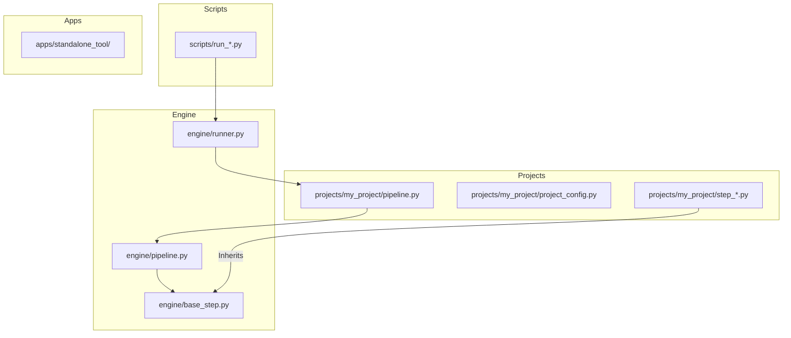

# Proposed Project Restructuring Plan

## 1. Overview
The current project structure has evolved into a mix of framework logic, project-specific data, and standalone applications, all sharing the root directory or nested deep within `openhands_operation/`. This proposal aims to separate these concerns to improve maintainability, clarity, and scalability.

## 2. Proposed Directory Structure

```text
/
├── engine/                     # Core Framework Logic (formerly openhands_operation/)
│   ├── base_step.py            # Abstract base classes
│   ├── pipeline.py             # Orchestration engine
│   ├── runner.py               # High-level task runner
│   ├── config.py               # Framework-wide configuration
│   └── requirements.txt        # Framework dependencies
├── projects/                   # Project Definitions (formerly openhands_operation/projects/)
│   ├── _template/              # Project boilerplate
│   ├── hcbe_techdocs/          # Healthcare Backend Documentation project
│   ├── cloudflare-workers/     # Cloudflare Workers project
│   └── ...
├── workspaces/                 # Project Workspaces (Runtime Output)
│   ├── my_project/             # Working directory for a specific run
│   └── ...
├── scripts/                    # Execution Scripts (formerly root run_*.py)
│   ├── run_hplms_be_doc.py
│   ├── run_mcp_internet.py
│   └── ...
├── apps/                       # Standalone Codebases/Tools
│   ├── mcp_internet/           # Standalone MCP server
│   ├── meeting_member_vy/      # Independent project/experiment
│   └── ...
├── plans/                      # Documentation and Architectural Plans
│   └── ...
├── .gitignore
└── README.md
```

## 3. Key Changes and Reasoning

### A. Rename `openhands_operation/` to `engine/`
- **Reasoning**: `engine` or `core` more clearly communicates that this directory contains the reusable framework logic. It separates the "how" (the execution engine) from the "what" (the project data).
- **Impact**: Requires updating imports in execution scripts and project pipelines.

### B. Promote `projects/` to the Root Level
- **Reasoning**: Projects are the primary focus for users. Moving them out of the engine directory prevents the framework code from being cluttered with project-specific data (steps, configurations).
- **Intuition**: `projects/` becomes the "Data/Configuration" layer.

### C. Consolidate Execution Scripts into `scripts/`
- **Reasoning**: The root directory is currently cluttered with many `run_*.py` files. Moving them to a dedicated directory makes the project entry points easier to manage and the root directory much cleaner.
- **Intuition**: `scripts/` becomes the "Trigger" layer.

### D. Move Standalone Projects to `apps/`
- **Reasoning**: Directories like `mcp_internet/` and `meeting_member_vy/` are independent entities that are not part of the framework engine or its projects. Placing them in `apps/` (or `external/` / `tools/`) clearly identifies them as separate codebases.
- **Intuition**: `apps/` represents independent functionality.

### E. Centralize Runtime Output in `workspaces/`
- **Reasoning**: Currently, OpenHands creates `workspace/` directories inside the code package or in the root. Centralizing all runtime output in a top-level `workspaces/` directory keeps the project organized and makes it easier to manage/clean temporary data.
- **Intuition**: `workspaces/` is the "Output" layer.

## 4. Implementation Strategy

1.  **Preparation**:
    - Identify all import paths that need to be updated.
    - Ensure `sys.path` manipulations in project pipelines are adjusted to find the new `engine/` location.
2.  **Migration**:
    - Create new directories: `engine/`, `projects/`, `scripts/`, `apps/`.
    - Move files to their respective locations.
3.  **Refactoring**:
    - Update `from openhands_operation...` to `from engine...`.
    - Update `engine/config.py` to use `workspaces/` as the default parent directory for project workspaces.
    - Update `engine/runner.py` default `workspace` path to point to `workspaces/default`.
    - Update relative paths in configuration files.
4.  **Verification**:
    - Run a few sample scripts to ensure the paths and imports are correct.

## 5. Mermaid Diagram of Dependencies


